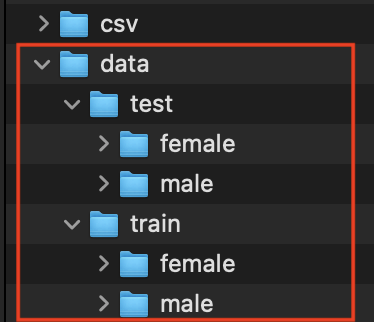

**Introduction**
---
Machine Learning (ML) is playing an important role in real-world tasks and explaining why a 
ML model made a decision could be crucial. The importance of this research 
arises because gender recognition is crucial in social interactions with intelligent 
applications. 

The scope of this project will be to use three pre-trained models (VG16, Inception, and Resnet),
to infer gender (male or female) from images, and to interpret the results with Class Activation Maps (CAMs)
and SHAP.

The data that will be used for this project is the CelebA dataset [1], which contains 200K images of 
celebrities with their corresponding attributes, including gender.

To see the full project paper please  visit:
[Link to paper](https://github.com/rnzCast/Capstone6501-renzo/blob/master/Deliverables/Final%20Submission%20-%20Journal/Journal%20-%20Renzo%20P.%20Castagnino.docx)

Considering the complexity of the project, and to the limitations in GitHub to upload the data, 
there are multiple steps and instructions to follow in order to run the code.

**Installation Options**
---

1. Install with [`pip`]
    + `$ pip install shap`
    + `$ pip install path`
    + `$ pip install torch`
    + `$ pip install torchvision==0.1.8`
    

**Configuration and Setup**
---

**1. GETTING THE DATA READY**

The first part is have the data ready to run the pre-trained models. The following steps will guide to
though the process of downloading the data and prepare it for the training.

1.1. Download the dataset:
[Link to CelebA Dataset](https://drive.google.com/file/d/0B7EVK8r0v71pZjFTYXZWM3FlRnM/view?usp=sharing)
          
1.2. Unzip the folder and paste it in the directory of the project. The name of this folder should be: 
`img_align_celeba`

1.3. create an empty `data` folder as follows:

The folder should have `test` and `train` folders, with `female` and `male` each one. It's ok if it is emtpy;
this will be populated after we run our `load_data.py` file.

1.4. Open and run the file `load_data.py`. This file will read the images from the`img_align_celeba`, 
will read the .csv file `celeba_list_attr.csv`, and will copy the images accordingly in the `data` folder
with a train/test split of 80 - 20%. After the process is done, check that the images are properly copied.

1.5. Done! Data is ready to be run for the model.

**2. RUNNING THE PRE-TRAINED MODELS**

There are 3 files to run: `VGG16.py`, `Inception.py`, and `ResNet.py`. Each file will download their 
corresponding pre-trained models into the folder `PreTrained_Models`. After the training, the new
fine-tuned models will be store in the folder `models`.

    + VGG16
    	- This file is ready to run, no further setup is required.
    + Inception
    	- This file is ready to run, no further setup is required.
    + ResNet
    	- This file is ready to run, no further setup is required.

After each model has finished. Check the folder `models`, you should see the 3 fined-tuned created here.

**2. RUNNING THE INTERPRETABILITY MODELS**

2.1. Class Activation Maps (CAMs)

In this file you need to specify 2 things:

- The folder to read the images to be analyzed by CAM, in our case `val_female` or `val_male`.
    This can be done inside the `CAM.py` file, in the variable `folder_path`.
  
- The second is the name of the output file with the results. In the `CAM.py` file, is the variable
`output_file_name`.
  
NOTE: CAM only read images with extension `.jpg`.

2.2. SHAP with Integrated Gradient

The `SHAP.py` file  analyzes one image at a time. You need to specify 3 things:

- The folder to read the images to be analyzed by SHAP, in our case `val_female` or `val_male`.
    This can be done inside the `SHAP.py` file, in the variable `folder_path`.

- The name of the image to be analyzed in the variable `img_name`. 

- The model to useto explain the gradients. This can be done in the variable `model_to_run`. use 1 for `VGG-16`, 2 for
`Inception` and 3 for `ResNet`.
  
NOTE: SHAP only read images with extension `.jpg`.

**3. RESULTS**

The results for both CAM and SHAP can be found in the folder `image_results`.

